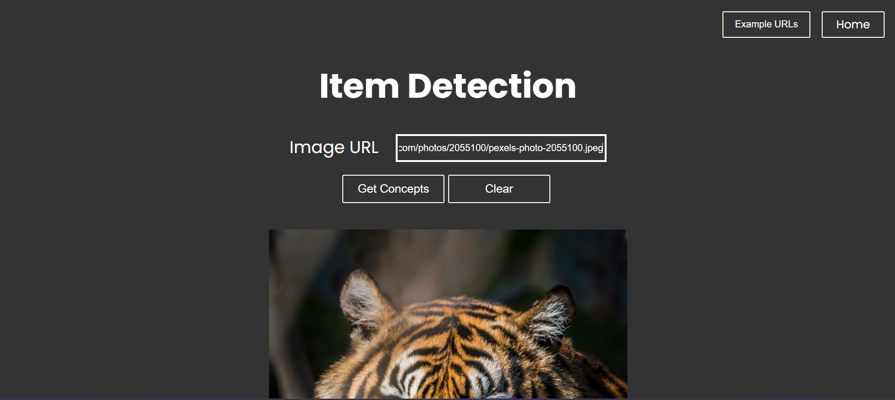
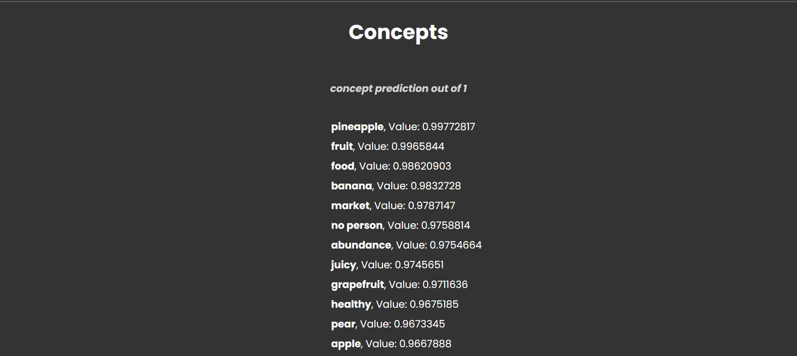

# ItemDetector, a website that does general item recognition

## Uses the Clarifai API to access the trained general-image-recognition model

## (View the website live)[]

This website identifies a variety of concepts in images including objects, themes, and more. Trained with over 10,000 concepts and 20M images

<p align="center">
    
</p>

- takes an input URL from the user

<p align="center">
    
</p>
  
- once the image is uploaded you get buttons to generate concepts or clear the image
- if you click on the clear button it removes the URL and the image
- if you click on the generate concepts button, it sets the API call pending state to true
- this pending state is passed to the API call, and after the API call is made the API pending state is set to false as the API call is made
- the concepts data is retrieved from the clarifai API and displayed for the inputed image

<p align="center">
    
</p>

## Technologies Used

- [](https://reactjs.org/)
- [](https://sass-lang.com/)
- [](https://material-ui.com/)
- [](https://www.clarifai.com/)


## Click on the link to watch the video demo

[Item Detector](https://youtu.be/4lWT5P4UlUk)

## How to get the project working on your device

- clone the repository
   ```sh
   git clone https://github.com/your_username_/Project-Name.git
   ```
- navigate to the project directory and install all dependencies
  ```sh
   npm install
   ```
- create an account on Clarifai
- to see the model API go to [Clarifai API](https://clarifai.com/clarifai/main/models/general-image-recognition)
- replace the pat key with your personal Clarifai pat key 
- run the project
   ```sh
     npm start
     ```

